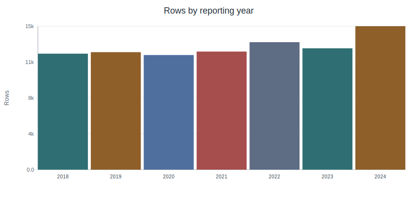
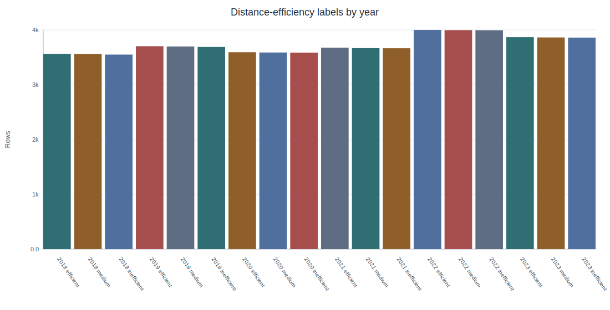
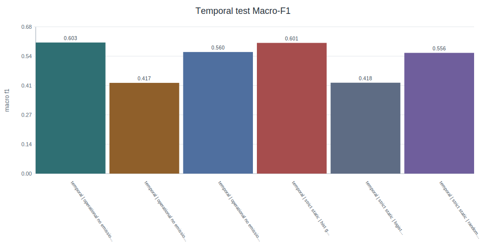
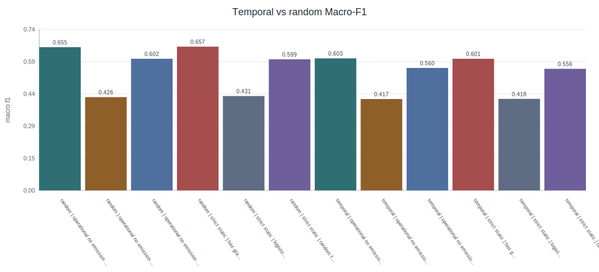
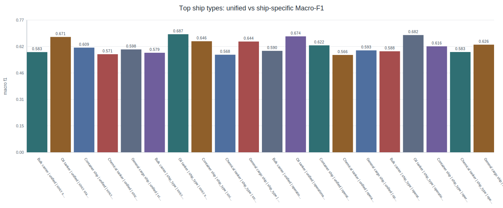
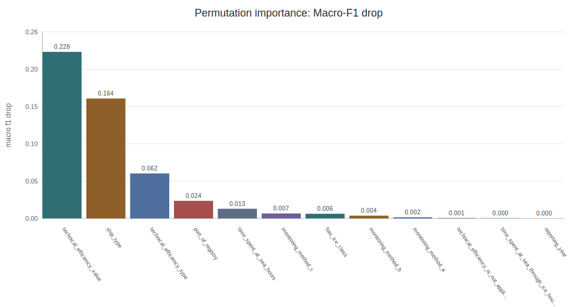
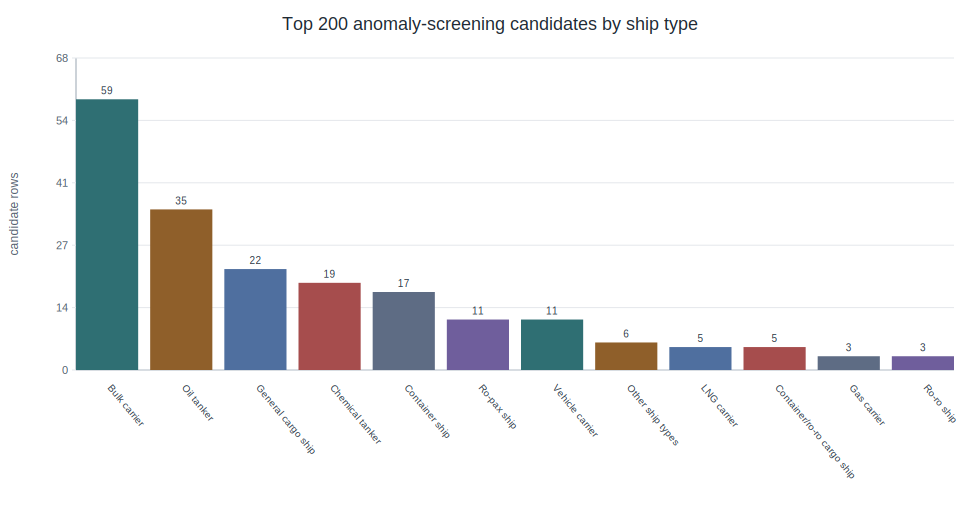
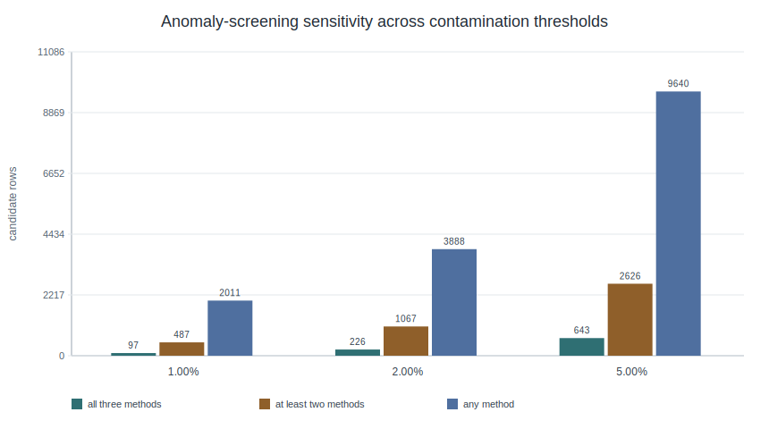

# MRV-EffScreen: Temporal Generalization and Consistency Screening of Ship Energy-Efficiency Labels from Public THETIS-MRV Emission Reports

Version: English internal review draft v0.3.1  
Date: 2026-05-20  
Article type: Article  
Project abbreviation: MRV-EffScreen  
Repository: https://github.com/TristanLib/MRV-EffScreen  

Author: Bo Li  
Affiliation: China Maritime Service Center  
Corresponding author: Bo Li, li.bo@cmaritime.com.cn  
ORCID: 0009-0002-0772-5138  

## Abstract

Public ship-level emission reports provide a transparent basis for data-driven maritime decarbonization studies, but predictive analyses must avoid target leakage and must be evaluated under realistic temporal shifts. This study proposes MRV-EffScreen, a reproducible framework for relative ship energy-efficiency stratification and emission consistency screening using public EU THETIS-MRV emission reports. We harmonized 2018-2024 public records, constructed ship-type-year tertile labels from CO2 emissions per distance, and evaluated non-leakage static and non-emission operational features under a temporal design. The main experiment trained models on 2018-2021 records, validated on 2022 records, tested on 2023 records, and used 2024 full-year reports as an external-year check. The processed dataset contained 90,745 records, 22,551 unique IMO numbers, and 17 ship types; the main labeled 2018-2023 experiment contained 73,045 records. Histogram-based gradient boosting with non-emission operational features achieved Macro-F1 = 0.603 and balanced accuracy = 0.605 on the 2023 temporal test set, while the best random stratified split reached Macro-F1 = 0.657, indicating optimistic random-split estimates. Class-level analysis showed that the medium class remained the main ambiguity source. A separate consistency-screening module combining Isolation Forest, Local Outlier Factor, and regression residual ranking identified 226 all-method candidates at a 2% threshold. Public candidate tables remove direct vessel identifiers and are intended for manual inspection, not compliance adjudication.

## Keywords

green shipping; THETIS-MRV; ship energy efficiency; temporal generalization; machine learning; anomaly screening; emission consistency; maritime decarbonization

## 1. Introduction

International shipping is central to global trade and remains a difficult-to-decarbonize transport sector. The Fourth IMO Greenhouse Gas Study reported that greenhouse gas emissions from shipping increased between 2012 and 2018 and that shipping accounted for a measurable share of global anthropogenic emissions [5]. The 2023 IMO greenhouse gas strategy further strengthened the long-term ambition for international shipping to reach net-zero greenhouse gas emissions by or around 2050, with indicative checkpoints for 2030 and 2040 [6]. Operational instruments such as the Energy Efficiency Existing Ship Index (EEXI) and Carbon Intensity Indicator (CII) also reflect a broader regulatory shift from isolated technical standards toward repeated annual monitoring and operational carbon-intensity assessment [7].

The European Union monitoring, reporting, and verification (EU MRV) system is one of the most important public ship-level emission data sources. THETIS-MRV publishes annual emission reports for ships covered by the MRV regulation, including CO2 emissions, fuel consumption, distance travelled, time spent at sea, cargo-related variables, ship type, and technical efficiency information [1-3]. Regulation (EU) 2023/957 further links maritime MRV to the EU Emissions Trading System and extends the monitoring context to additional greenhouse gases and ship types [4]. These records are not voyage-level operational traces, but they provide official, structured, and annually repeated ship-level observations. This makes the dataset particularly valuable for reproducible studies on maritime emissions and green-shipping decision support.

Previous work has used EU MRV data to describe ship emissions, assess regulatory implications, and review early patterns after the mechanism's implementation. Bullock et al. showed how the early release of EU MRV data enabled ship-level analysis of committed shipping emissions [11]. Yan et al. developed quantitative MRV-based fuel-consumption prediction models using early MRV records and external ship features [8]. Luo et al. reviewed five years of MRV mechanism application and argued that the public data remain under-exploited for parameter analysis, temporal interpretation, and future policy support [9]. Xing et al. recently used MRV data to review ship energy-efficiency framework issues and operational-profile differences among ship types [10]. These studies establish the value of MRV data, but there remains a practical methodological gap: how can public MRV tables be used for predictive energy-efficiency stratification without leaking the target variable, and how should models be evaluated when deployment would require generalization to later reporting years?

Target leakage is a central risk in this setting. If a label is derived from CO2 emissions per distance, then total CO2 emissions, fuel consumption, fuel per distance, and related intensity variables are formulaically or physically close to the target. Including them in the main classification features would produce overly optimistic results and would obscure whether the model learns any deployable non-leakage signal. Leakage has been recognized as a general source of invalid performance estimates in data mining and predictive modeling [17]. For public regulatory datasets, this issue is especially important because misleadingly strong results can lead to inappropriate interpretations in policy-facing contexts.

This study therefore separates two tasks. The first task is relative efficiency stratification using only non-leakage static and non-emission operational features. The second task is emission consistency screening, where fuel, CO2, distance, time, and intensity fields are intentionally used to identify records that deserve manual inspection. The second task is not framed as fraud detection, violation detection, or compliance adjudication.

The contributions of this study are as follows:

1. A reproducible 2018-2024 THETIS-MRV processing workflow is built, with 2018-2023 used as the stable-schema main experiment and 2024 full-year reports retained as an external-year check.
2. A ship-type-year tertile label is defined from CO2 emissions per distance to support relative efficiency stratification within comparable fleet-year groups.
3. Non-leakage feature sets are evaluated under temporal extrapolation and random stratified evaluation, showing that random splits overestimate generalization.
4. Unified and ship-type-specific models are compared for the five largest ship types, revealing selective but not universal gains from specialization.
5. A separate consistency-screening module combines Isolation Forest, Local Outlier Factor, and regression residual ranking to prioritize anomaly-screening candidates for manual review.

## 2. Related Work

### 2.1. Maritime decarbonization and MRV data

Maritime decarbonization depends on both technological change and reliable operational monitoring. IMO policy has increasingly emphasized vessel-level and annual carbon-intensity assessment, while EU MRV provides a public reporting infrastructure for ship-level emissions and related operational parameters [1-7]. Compared with aggregate inventories, MRV records provide much finer ship-level granularity. Compared with commercial vessel databases or AIS-derived proprietary products, the public MRV releases are open and reproducible, although their annual aggregation limits the ability to model voyage-level drivers such as weather, speed profiles, port congestion, and loading conditions.

Recent MRV studies show a clear progression from descriptive analysis toward quantitative modeling. Bullock et al. used early MRV data to assess shipping emissions in relation to climate commitments [11]. Yan et al. used MRV records and additional vessel attributes to predict annual average fuel consumption by ship type [8]. Luo et al. synthesized the first five years of MRV operation and emphasized both policy relevance and remaining data-use gaps [9]. Xing et al. further examined MRV-reported operational profiles and energy-efficiency indicators under the evolving technical and operational efficiency framework [10]. In parallel, machine-learning studies using onboard or in-service data have shown the value of tree ensembles and related models for ship energy-consumption prediction [12]. MRV-EffScreen differs from these lines by using only public annual MRV tables, by explicitly separating non-leakage classification from consistency screening, and by treating temporal generalization as the main evaluation target.

### 2.2. Relative ship efficiency labels and fleet heterogeneity

Ship energy efficiency cannot be compared meaningfully without considering ship type, scale, and operating context. Bulk carriers, tankers, container ships, passenger ships, and specialized vessels differ in design, cargo function, and normal operating profiles. The proposed label is therefore constructed within each ship-type-year group rather than across all ships. This choice is not a replacement for EEXI, CII, or any regulatory score. Instead, it creates a reproducible relative task inside the public MRV data.

Fleet heterogeneity also affects modeling strategy. A unified model benefits from larger training data and can learn cross-ship-type regularities. Ship-type-specific models may capture category-specific patterns but use fewer records and may overfit. This trade-off motivates the ship-type ablation performed in this study.

### 2.3. Leakage control and anomaly screening

The same MRV variables can play different roles depending on the task. CO2 and fuel variables are unsuitable as features for predicting a label derived from CO2 intensity, but they are relevant for consistency screening. This distinction is central to MRV-EffScreen. The classification feature sets exclude target-family variables; the consistency-screening feature set uses them only in an unsupervised or residual-screening context.

Isolation Forest isolates unusual observations through random partitioning and is well suited to large tabular datasets [15]. Local Outlier Factor identifies observations whose local density differs from that of neighboring points [16]. Regression residual ranking provides a complementary view by measuring whether a reported CO2-per-distance value is difficult to reconstruct from related consistency fields. Combining these methods reduces dependence on a single anomaly score.

## 3. Materials and Methods

### 3.1. Data source and scope

This study uses public emission reports released through EU THETIS-MRV. Raw workbooks were downloaded by reporting year and versioned locally with interface metadata and SHA256 checksums. The 2018-2023 workbooks share a stable 62-column schema. The 2024 workbook expands to 113 columns, adding company, methane, nitrous oxide, CO2-equivalent, and EU ETS-related fields. To preserve comparability, the main predictive experiment uses the stable 2018-2023 schema, while 2024 full-year emission reports are used as an external-year check. Partial 2024 emission reports are excluded from the main evaluation because their reporting periods do not represent complete annual operation.

Table 1 summarizes the processed data coverage and temporal split.

**Table 1. Dataset coverage and temporal split statistics.**

| Quantity | Value |
|---|---:|
| Processed records, 2018-2024 | 90,745 |
| Main-experiment records, 2018-2023 | 75,580 |
| Main-experiment labeled records | 73,045 |
| 2024 full-year external records | 14,139 |
| 2024 partial records excluded | 1,026 |
| Unique IMO numbers | 22,551 |
| Ship types | 17 |
| Train, 2018-2021 labeled records | 47,380 |
| Validation, 2022 labeled records | 13,050 |
| Test, 2023 labeled records | 12,615 |
| External check, 2024 full-year labeled records | 12,905 |

Technical efficiency strings were parsed into a type, a numerical value, and a not-applicable indicator. Missing categorical values were explicitly represented. Numerical imputation was performed inside model pipelines using training-set information.

### 3.2. Relative efficiency label

The main target is a three-class relative efficiency label derived from `co2_per_distance_kg_nm`. Within each `ship_type` and `reporting_year` group, records are ranked by CO2 emissions per distance and divided into tertiles:

1. `efficient`: lower tertile within the ship-type-year group.
2. `medium`: middle tertile within the ship-type-year group.
3. `inefficient`: upper tertile within the ship-type-year group.

This construction avoids direct comparison of raw CO2 intensity across fundamentally different ship categories and controls for annual shifts in fleet composition and reporting conditions. It also produces approximately balanced classes. The label is descriptive and relative within the MRV dataset; it is not a regulatory compliance label.

### 3.3. Feature sets and leakage control

Two non-leakage feature sets are used for the main classification task.

The `strict_static` set includes reporting year, ship type, parsed technical efficiency fields, port-of-registry information, home-port and ice-class indicators, and monitoring-method indicators. The `operational_no_emission` set adds non-emission operational variables such as time spent at sea and ice-navigation variables.

Target-family fields are excluded from classification. These include CO2 intensity, total CO2 emissions, fuel consumption, fuel intensity, transport-work intensity, and on-laden variants. The broader `consistency_screening` field set is reserved for the separate anomaly-screening task.

### 3.4. Temporal evaluation and models

The primary evaluation is temporal:

1. Train: 2018-2021 labeled records.
2. Validation: 2022 labeled records.
3. Test: 2023 labeled records.
4. External-year check: 2024 full-year labeled records.

A random stratified 80/20 split over 2018-2023 is included only as an optimistic comparison. Practical use would require applying a model trained on earlier reports to later reports; therefore, temporal evaluation is the main evidence.

Three classifiers are evaluated: Logistic Regression with class balancing, Random Forest with balanced subsampling, and Histogram-based Gradient Boosting. Random forests and gradient boosting are established tabular-learning baselines and have also been widely used in ship energy-consumption studies [12-14]. Numerical features are median-imputed. Categorical features are one-hot encoded for Logistic Regression and Random Forest and ordinal-encoded for Histogram-based Gradient Boosting. Macro-F1 and balanced accuracy are the primary metrics. The implementation uses Python and scikit-learn [18]. Table 2 summarizes the core reproducible configuration.

**Table 2. Core experimental configuration used for reproducible modeling.**

| Component | Setting | Notes |
|---|---|---|
| Random seed | 42 | Used for model training, random split, permutation importance, and residual cross-validation. |
| Logistic Regression | `class_weight=balanced`; `solver=lbfgs`; `max_iter=800` | Linear baseline with one-hot categorical encoding. |
| Random Forest | `n_estimators=180`; `max_depth=16`; `min_samples_leaf=5` | Uses balanced-subsample class weighting. |
| Histogram Gradient Boosting | `learning_rate=0.05`; `max_iter=220`; `max_leaf_nodes=31` | Uses ordinal categorical encoding and L2 regularization = 0.05. |
| Random comparison | Stratified 80/20 split | Included only as an optimistic reference against temporal evaluation. |
| Anomaly screening | Ship-type-specific models; minimum 300 eligible rows | Primary per-method threshold is 2%; sensitivity uses 1%, 2%, and 5%. |
| Residual screening | HGB regressor; 3-fold cross-validation | Predicts log-transformed CO2 per distance from consistency fields. |

### 3.5. Ship-type ablation, interpretability, and error analysis

The ship-type ablation compares a unified model trained on all ship types with separate models trained for the five largest ship types: Bulk carrier, Oil tanker, Container ship, Chemical tanker, and General cargo ship. The ablation uses Histogram-based Gradient Boosting under both non-leakage feature sets.

Permutation importance is computed for the best temporal classifier using Macro-F1 drop after feature permutation. Error analysis focuses on medium-class records, because these records sit near tertile boundaries and are expected to have less stable class membership than the efficient and inefficient extremes.

### 3.6. Consistency screening

The consistency-screening module is separate from classification. It uses complete annual reports with positive values for fuel consumption, fuel per distance, total CO2 emissions, CO2 per distance, and time spent at sea. Models are fitted separately by ship type, and ship types with fewer than 300 eligible rows are recorded but not modeled.

Three methods are used:

1. Isolation Forest for multivariate outlier screening.
2. Local Outlier Factor for local-density outlier screening.
3. Regression residual ranking, where CO2 emissions per distance is predicted from related consistency fields and large residuals are prioritized.

The consensus anomaly score is the average of within-ship-type rank percentiles from the three methods. Candidate rows are described as anomaly-screening candidates for subsequent manual inspection. They are not interpreted as regulatory violations, fraud, or false reporting. Sensitivity is assessed using 1%, 2%, and 5% per-method ship-type thresholds.

## 4. Results

### 4.1. Main temporal classification

Table 3 reports the main classification results. The best temporal result is obtained by Histogram-based Gradient Boosting with the Operational feature set. On the 2023 test set, it reaches Macro-F1 = 0.603 and balanced accuracy = 0.605. The Static model is close, with Macro-F1 = 0.601 and balanced accuracy = 0.603, indicating that the added non-emission operational fields provide only a small improvement.

**Table 3. Classification performance under temporal, external-year, and random stratified evaluation settings.**

| Split | Feature set | Model | Rows | Macro-F1 | Balanced accuracy |
|---|---|---|---:|---:|---:|
| 2023 test | operational_no_emission | HistGradientBoosting | 12,615 | 0.603 | 0.605 |
| 2023 test | strict_static | HistGradientBoosting | 12,615 | 0.601 | 0.603 |
| 2023 test | operational_no_emission | Random Forest | 12,615 | 0.560 | 0.573 |
| 2023 test | strict_static | Random Forest | 12,615 | 0.556 | 0.567 |
| 2024 full-year | operational_no_emission | HistGradientBoosting | 12,905 | 0.585 | 0.587 |
| 2024 full-year | strict_static | HistGradientBoosting | 12,905 | 0.580 | 0.582 |
| Random test | strict_static | HistGradientBoosting | 14,609 | 0.657 | 0.660 |
| Random test | operational_no_emission | HistGradientBoosting | 14,609 | 0.655 | 0.658 |

The random stratified evaluation gives higher performance than the temporal evaluation. The best random split reaches Macro-F1 = 0.657, compared with Macro-F1 = 0.603 in the 2023 temporal test. This gap supports the use of temporal extrapolation as the main generalization test.

Class-level metrics show where the temporal model is strongest and weakest. On the 2023 temporal test set, the best model reaches F1 = 0.694 for the efficient class, F1 = 0.487 for the medium class, and F1 = 0.629 for the inefficient class. The corresponding recalls are 0.745, 0.485, and 0.585, respectively. On the 2024 full-year external check, efficient-class F1 remains similar at 0.692, while medium and inefficient F1 decline to 0.479 and 0.584. This pattern confirms that the middle tertile is the least stable class and that the external-year decrease is concentrated mainly in the boundary and upper-intensity classes.

**Table 4. Class-level metrics for the best non-leakage temporal classifier.**

| Split | Class | Precision | Recall | F1 | Support | Predicted rows |
|---|---|---:|---:|---:|---:|---:|
| 2023 test | efficient | 0.649 | 0.745 | 0.694 | 4,210 | 4,833 |
| 2023 test | medium | 0.488 | 0.485 | 0.487 | 4,204 | 4,175 |
| 2023 test | inefficient | 0.681 | 0.585 | 0.629 | 4,201 | 3,607 |
| 2024 external | efficient | 0.647 | 0.743 | 0.692 | 4,314 | 4,953 |
| 2024 external | medium | 0.467 | 0.492 | 0.479 | 4,305 | 4,539 |
| 2024 external | inefficient | 0.659 | 0.525 | 0.584 | 4,286 | 3,413 |

### 4.2. Ship-type ablation

Table 5 shows that ship-type-specific modeling has heterogeneous effects. General cargo ship benefits under both feature sets, and Container ship improves under `strict_static`. Oil tanker shows smaller gains. Bulk carrier does not improve, and Container ship under `operational_no_emission` is slightly worse than the unified model.

**Table 5. Unified versus ship-type-specific modeling for the five largest ship categories.**

| Ship type | Feature set | Unified Macro-F1 | Ship-type Macro-F1 | Delta |
|---|---|---:|---:|---:|
| General cargo ship | strict_static | 0.598 | 0.644 | +0.046 |
| Container ship | strict_static | 0.609 | 0.646 | +0.037 |
| General cargo ship | operational_no_emission | 0.593 | 0.626 | +0.033 |
| Chemical tanker | operational_no_emission | 0.566 | 0.583 | +0.017 |
| Oil tanker | strict_static | 0.671 | 0.687 | +0.016 |
| Oil tanker | operational_no_emission | 0.674 | 0.682 | +0.008 |
| Bulk carrier | operational_no_emission | 0.590 | 0.588 | -0.003 |
| Chemical tanker | strict_static | 0.571 | 0.568 | -0.003 |
| Bulk carrier | strict_static | 0.583 | 0.579 | -0.004 |
| Container ship | operational_no_emission | 0.622 | 0.616 | -0.006 |

The correct interpretation is therefore selective specialization rather than universal superiority of ship-type-specific models.

### 4.3. Feature importance and medium-class errors

Permutation importance identifies `technical_efficiency_value` as the strongest non-leakage feature, with a Macro-F1 drop of 0.228 after permutation. The next strongest predictors are `ship_type`, `technical_efficiency_type`, `port_of_registry`, and `time_spent_at_sea_hours`.

**Table 6. Permutation importance and dominant medium-class error patterns.**

| Analysis | Rank | Item | Value | Interpretation |
|---|---:|---|---:|---|
| Permutation importance | 1 | Technical efficiency value | 0.228 | Macro-F1 drop |
| Permutation importance | 2 | Ship type | 0.164 | Macro-F1 drop |
| Permutation importance | 3 | Technical efficiency type | 0.062 | Macro-F1 drop |
| Permutation importance | 4 | Port of registry | 0.024 | Macro-F1 drop |
| Permutation importance | 5 | Time spent at sea | 0.013 | Macro-F1 drop |
| Medium error | 1 | Bulk carrier medium -> efficient | 339 | Most frequent medium-class error |
| Medium error | 2 | Container ship medium -> inefficient | 261 | Most frequent medium-class error |
| Medium error | 3 | General cargo ship medium -> inefficient | 176 | Most frequent medium-class error |
| Medium error | 4 | Bulk carrier medium -> inefficient | 169 | Most frequent medium-class error |
| Medium error | 5 | Container ship medium -> efficient | 161 | Most frequent medium-class error |

The medium class is the main ambiguity source, which is consistent with the tertile-label design. The efficient and inefficient classes represent the more stable extremes, while medium records lie close to class boundaries.

### 4.4. Consistency screening and sensitivity analysis

The consistency-screening experiment models 85,932 complete annual rows across 14 ship types. At the 2% threshold, each method flags 1,727 rows. The all-three-method overlap contains 226 rows, while the at-least-two-method set contains 1,067 rows. The top 200 consensus candidates are mainly from Bulk carrier, Oil tanker, General cargo ship, Chemical tanker, and Container ship.

**Table 7. Sensitivity of anomaly-screening candidates under 1%, 2%, and 5% ship-type-specific thresholds.**

| Threshold | Isolation rows | LOF rows | Residual rows | All three | At least two | Any method | Top 200 at least two | Top 200 all three |
|---:|---:|---:|---:|---:|---:|---:|---:|---:|
| 1% | 865 | 865 | 865 | 97 | 487 | 2,011 | 189 | 97 |
| 2% | 1,727 | 1,727 | 1,727 | 226 | 1,067 | 3,888 | 200 | 182 |
| 5% | 4,303 | 4,303 | 4,303 | 643 | 2,626 | 9,640 | 200 | 200 |

At the strict 1% setting, 189 of the top 200 consensus candidates are still flagged by at least two methods. At the broad 5% setting, all top 200 candidates are flagged by all three methods. These results indicate that the top consensus list is relatively stable across reasonable threshold choices.

The public candidate table removes direct vessel identifiers and should be read as a pattern summary rather than a list of vessel-level findings. Within the top 200 consensus candidates, 182 rows are flagged by all three methods at the 2% threshold and 18 rows are flagged by two methods. The largest ship-type groups are Bulk carrier (59), Oil tanker (35), General cargo ship (22), Chemical tanker (19), and Container ship (17). Directional diagnostics split into low-intensity or low-volume patterns (77 rows), high-intensity or high-volume patterns (51 rows), and mixed patterns (72 rows). This diversity supports the use of a manual-review queue rather than a single deterministic anomaly rule.

## 5. Discussion

The results support three main findings. First, public MRV tables contain enough non-leakage information to support moderate temporal prediction of relative ship energy-efficiency strata. The performance level is not high enough to justify automated decision-making, but it is credible for screening, descriptive stratification, and decision-support analysis. The key methodological point is that performance is measured under temporal extrapolation rather than only under a random split.

Second, random stratified evaluation is optimistic for this dataset. A random split can mix similar reporting years and potentially recurring ships across train and test partitions. The observed Macro-F1 gap between the random split and temporal test confirms that annual generalization should be the primary evaluation design for repeated regulatory-reporting datasets.

Third, ship-type specialization is useful only for some categories. This is consistent with the competing effects of fleet heterogeneity and training-sample size. General cargo ship benefits from specialization, whereas Bulk carrier does not. The practical implication is that future applications should not assume a single modeling architecture is best for all ship categories.

The feature-importance results are plausible and useful for interpretation. Technical efficiency value is the strongest non-leakage predictor, followed by ship type and technical efficiency type. This does not establish causality. It indicates that technical efficiency information is strongly associated with relative operational CO2-per-distance strata in the public MRV records.

The consistency-screening module should be interpreted cautiously. It uses variables that would be leakage-prone in classification, but those same variables are relevant for identifying records with unusual fuel, CO2, distance, time, and intensity combinations. Because no external audit labels are available, the output is a prioritized manual-inspection list rather than proof of incorrect reporting. For this reason, public supplementary tables remove direct vessel identifiers and use candidate ranks and pattern fields instead of binding vessel identifiers to anomaly-screening judgments.

Several limitations remain. The tertile label is relative and data-internal; it is not equivalent to CII, EEXI, or any compliance status. The data are annual aggregates and cannot capture voyage-level drivers such as speed, route, weather, loading, or port waiting time. The 2024 schema is broader than earlier schemas, so external-year interpretation requires care. Finally, the current models are deliberately lightweight; future work could compare specialized gradient-boosting libraries and could integrate AIS-derived operational variables where licensing permits.

## 6. Conclusions

This study presents MRV-EffScreen, a reproducible framework for public THETIS-MRV ship energy-efficiency stratification and emission consistency screening. Using 2018-2024 public records, the framework constructs ship-type-year relative labels, evaluates non-leakage features under temporal extrapolation, analyzes ship-type heterogeneity, and generates consensus anomaly-screening candidates. The best temporal classifier reaches Macro-F1 = 0.603 on the 2023 test set and Macro-F1 = 0.585 on the 2024 full-year external check, while random stratified evaluation gives a higher and more optimistic estimate. The consistency-screening module identifies stable manual-inspection candidates across threshold settings. The study demonstrates that public MRV data can support transparent machine-learning analysis when leakage control, temporal evaluation, and cautious interpretation are treated as first-order design requirements.

## Supplementary Materials

The following generated artifacts are intended for supplementary release or repository documentation: data dictionary, feature-set definitions, workbook inventory, schema audit tables, model metrics, confusion matrices, ship-type ablation results, identifier-removed anomaly-screening tables, anomaly-sensitivity tables, and source scripts. Final supplementary packaging should be updated again if a Zenodo DOI is minted.

## Author Contributions

Bo Li is the sole author and completed all CRediT roles: conceptualization, methodology, software, validation, formal analysis, investigation, resources, data curation, writing - original draft preparation, writing - review and editing, visualization, supervision, and project administration. The author has read and agreed to the published version of the manuscript.

## Funding

This research received no external funding.

## Data Availability Statement

The original public emission reports are available through the EU THETIS-MRV public emission report portal. The code, processing scripts, metadata, checksums, generated non-sensitive tables, figure files, and manuscript assets are available in the MRV-EffScreen repository at https://github.com/TristanLib/MRV-EffScreen. A Zenodo DOI will be added if the repository is archived after the first stable release.

## Acknowledgments

The author thanks his family for their support.

## Conflicts of Interest

The author declares no conflicts of interest.

## Use of Generative AI and AI-Assisted Technologies

During manuscript preparation and code development, AI-assisted tools were used to support drafting, code organization, language editing, and workflow documentation. The author reviewed, verified, and is responsible for all scientific content, analyses, interpretations, and final text.

## References

1. European Maritime Safety Agency. THETIS-MRV. Available online: https://emsa.europa.eu/thetis-mrv.html (accessed on 20 May 2026).
2. European Commission, Directorate-General for Climate Action. 2024 report from the European Commission on CO2 emissions from maritime transport. 2025. https://doi.org/10.2834/8958061.
3. European Union. Regulation (EU) 2015/757 on the monitoring, reporting and verification of carbon dioxide emissions from maritime transport. 2015.
4. European Union. Regulation (EU) 2023/957 amending Regulation (EU) 2015/757 in order to provide for the inclusion of maritime transport activities in the EU Emissions Trading System and for the monitoring, reporting and verification of emissions of additional greenhouse gases and emissions from additional ship types. 2023.
5. International Maritime Organization. Fourth IMO Greenhouse Gas Study 2020. 2020.
6. International Maritime Organization. Revised GHG reduction strategy for global shipping adopted. 2023.
7. International Maritime Organization. EEXI and CII - ship carbon intensity and rating system. Available online: https://www.imo.org/en/mediacentre/hottopics/pages/eexi-cii-faq.aspx (accessed on 20 May 2026).
8. Yan, R.; Mo, H.; Wang, S.; Yang, D. Analysis and prediction of ship energy efficiency based on the MRV system. Maritime Policy & Management 2023, 50, 117-139. https://doi.org/10.1080/03088839.2021.1968059.
9. Luo, X.; Yan, R.; Wang, S. After five years' application of the European Union monitoring, reporting, and verification (MRV) mechanism: Review and prospectives. Journal of Cleaner Production 2024, 434, 140006. https://doi.org/10.1016/j.jclepro.2023.140006.
10. Xing, H.; Chang, S.; Ma, R.; Wang, K. EU MRV Data-Based Review of the Ship Energy Efficiency Framework. Journal of Marine Science and Engineering 2025, 13, 1437. https://doi.org/10.3390/jmse13081437.
11. Bullock, S.; Mason, J.; Broderick, J.; Larkin, A. Shipping and the Paris climate agreement: a focus on committed emissions. BMC Energy 2020, 2, 5. https://doi.org/10.1186/s42500-020-00015-2.
12. Fan, A.; Wang, Y.; Yang, L.; Tu, X.; Yang, J.; Shu, Y. Comprehensive evaluation of machine learning models for predicting ship energy consumption based on onboard sensor data. Ocean & Coastal Management 2024, 248, 106946. https://doi.org/10.1016/j.ocecoaman.2023.106946.
13. Breiman, L. Random Forests. Machine Learning 2001, 45, 5-32. https://doi.org/10.1023/A:1010933404324.
14. Friedman, J.H. Greedy function approximation: A gradient boosting machine. The Annals of Statistics 2001, 29, 1189-1232. https://doi.org/10.1214/aos/1013203451.
15. Liu, F.T.; Ting, K.M.; Zhou, Z.-H. Isolation Forest. In Proceedings of the 2008 Eighth IEEE International Conference on Data Mining, 2008; pp. 413-422. https://doi.org/10.1109/ICDM.2008.17.
16. Breunig, M.M.; Kriegel, H.-P.; Ng, R.T.; Sander, J. LOF: Identifying Density-Based Local Outliers. In Proceedings of the 2000 ACM SIGMOD International Conference on Management of Data, 2000; pp. 93-104. https://doi.org/10.1145/335191.335388.
17. Kaufman, S.; Rosset, S.; Perlich, C. Leakage in data mining: Formulation, detection, and avoidance. ACM Transactions on Knowledge Discovery from Data 2012, 6, 1-21. https://doi.org/10.1145/2382577.2382579.
18. Pedregosa, F.; Varoquaux, G.; Gramfort, A.; Michel, V.; Thirion, B.; Grisel, O.; Blondel, M.; Prettenhofer, P.; Weiss, R.; Dubourg, V.; VanderPlas, J.; Passos, A.; Cournapeau, D.; Brucher, M.; Perrot, M.; Duchesnay, E. Scikit-learn: Machine Learning in Python. Journal of Machine Learning Research 2011, 12, 2825-2830.
